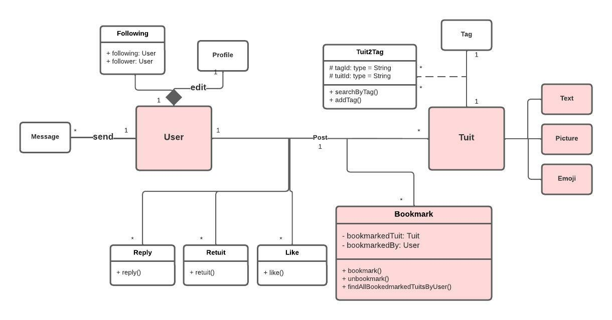

# UML Design

# RESTful API Design
## Users
- create user: /api/users/create
- delete user: /api/users/:uid/delete
- delete all user: /api/users/delete
- delete user by username: /api/users/username/:username/delete

## Authentication
- login: /api/auth/login
- register: /api/auth/register
- profile: /api/auth/profile
- logout: /api/auth/logout

## Tuits
- find all tuits: /api/tuits
- find all tuits by user: /api/users/:uid/tuits
- find tuit by id: /api/tuits/:tid
- create tuit by user: /api/users/:uid/tuits
- delete tuit: /api/tuits/:tid
- image upload: /api/tuits/image/upload

## Bookmark
- find All Tuits Bookmarked By User: /api/users/:uid/bookmarks
- find All Users That Bookmarked Tuit: /api/tuits/:tid/bookmarks
- user BookmarksTuit: /api/users/:uid/bookmarks/:tid
- user Unbookmarks Tuit: /api/users/:uid/bookmarks/:tid
- user Unbookmarks All Tuit: /api/users/:uid/bookmarks
- user Toggles Tuit Bookmarks: /api/users/:uid/bookmarks/:tid
- find User Bookmarked Tuit: /api/users/:uid/bookmarks/:tid

